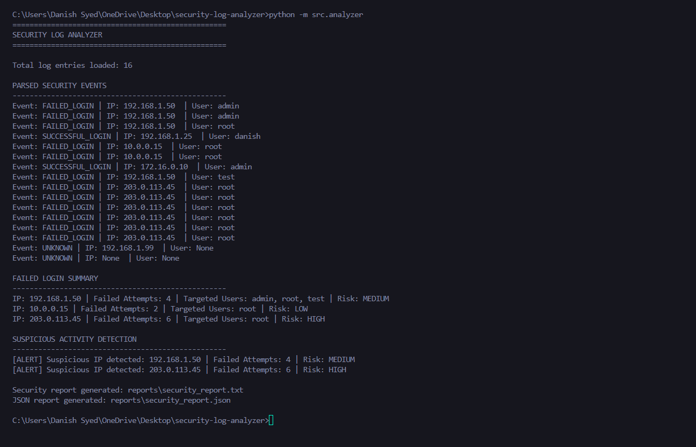
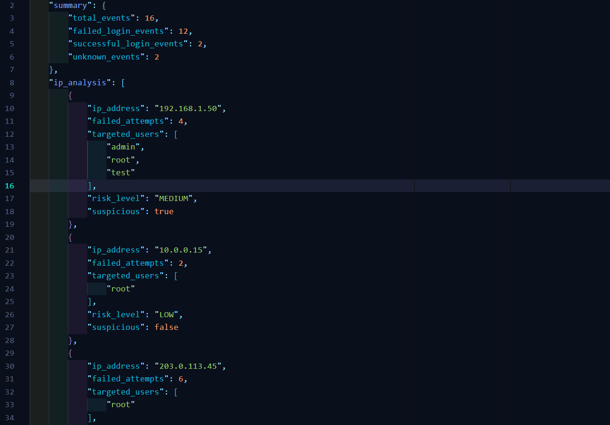
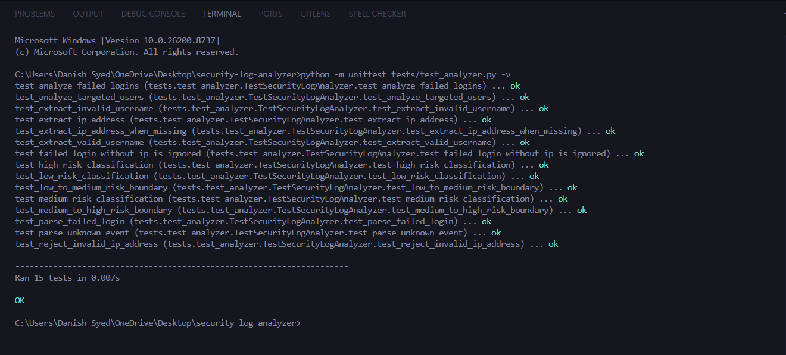

# Security Log Analyzer

A Python-based tool that analyzes sample SSH authentication logs and detects suspicious repeated failed-login activity using threshold-based rules.

I built this project as part of my cybersecurity learning to understand how raw authentication logs can be parsed, analyzed, and converted into useful security information.

The goal was not to build a production-level security tool, but to understand the basic workflow behind security log analysis: reading raw logs, identifying authentication events, extracting useful information, applying simple detection rules, handling unexpected data, and generating reports.

## What the Project Does

The analyzer reads SSH authentication logs and processes each entry to:

- classify failed, successful, and unknown authentication events;
- extract source IPv4 addresses;
- validate extracted IPv4 addresses;
- extract targeted usernames;
- count failed login attempts from each source IP;
- identify unique user accounts targeted by an IP;
- assign LOW, MEDIUM, or HIGH risk levels;
- flag repeated failed-login activity that crosses the configured threshold;
- generate TXT and JSON security reports.

The project also includes automated tests for the main parsing and analysis functions.

## How It Works

The basic workflow is:

```text
SSH Authentication Logs
        |
        v
Read Log Entries
        |
        v
Parse and Classify Events
        |
        v
Extract IP Addresses and Usernames
        |
        v
Validate IPv4 Addresses
        |
        v
Analyze Failed Login Attempts
        |
        v
Group Targeted User Accounts
        |
        v
Assign Risk Levels
        |
        v
Detect Suspicious Activity
        |
        v
Generate TXT and JSON Reports
```

## Risk Classification

The project uses simple threshold-based rules to classify failed-login activity.

| Failed Attempts | Risk Level |
| --------------- | ---------- |
| 1–2             | LOW        |
| 3–4             | MEDIUM     |
| 5 or more       | HIGH       |

An IP address is flagged as suspicious when it reaches the configured failed-login threshold.

These rules are intentionally simple and are meant for learning basic security log analysis. They should not be treated as a replacement for a real intrusion detection system or SIEM.

## Project Structure

```text
security-log-analyzer/
|
|-- logs/
|   `-- sample_auth.log
|
|-- reports/
|   |-- security_report.json
|   `-- security_report.txt
|
|-- screenshots/
|   |-- json-report.png
|   |-- terminal-analysis.png
|   `-- test-results.png
|
|-- src/
|   |-- __init__.py
|   `-- analyzer.py
|
|-- tests/
|   `-- test_analyzer.py
|
|-- .gitignore
`-- README.md
```

## Sample Analysis

The included sample log contains successful logins, failed login attempts, unknown events, and incomplete log entries.

After processing the sample data, the analyzer displays a summary of failed-login activity, targeted usernames, assigned risk levels, and suspicious activity alerts.



## JSON Report

Along with the human-readable TXT report, the analyzer also generates structured JSON output.

The JSON report contains:

- total event counts;
- failed, successful, and unknown event counts;
- source IP addresses;
- failed attempt counts;
- targeted usernames;
- assigned risk levels;
- suspicious activity status.



## Automated Tests

The project uses Python's built-in `unittest` framework.

The test suite currently contains 15 tests covering:

- valid IPv4 extraction;
- missing IP addresses;
- invalid IPv4 rejection;
- username extraction;
- SSH invalid-user log formats;
- failed-login event parsing;
- unknown event parsing;
- failed-login counting;
- targeted-user grouping;
- failed logins without IP addresses;
- LOW, MEDIUM, and HIGH risk classification;
- exact risk boundary conditions.



## Technologies Used

- Python
- Regular Expressions
- `ipaddress`
- `pathlib`
- `collections`
- JSON
- `unittest`
- Git and GitHub

The project uses only modules available in the Python standard library, so no third-party packages are required.

## How to Run the Project

### 1. Clone the repository

```bash
git clone https://github.com/0xdanzie/security-log-analyzer.git
```

### 2. Move into the project directory

```bash
cd security-log-analyzer
```

### 3. Run the analyzer

```bash
python -m src.analyzer
```

After execution, the generated reports can be found inside the `reports` directory.

## Running the Tests

Run the complete test suite with:

```bash
python -m unittest tests/test_analyzer.py -v
```

A successful test run should finish with:

```text
Ran 15 tests

OK
```

## What I Learned

While building this project, I learned how raw authentication logs can be processed step by step instead of treating log analysis as a single task.

I practiced using regular expressions to extract information, dictionaries and sets to organize security events, the `ipaddress` module to validate IPv4 addresses, and JSON to create structured output.

One useful lesson from the project was that extracting data is not the same as validating it. My first IP extraction logic used only a regular expression, which could also match invalid addresses. I later added validation using Python's `ipaddress` module and wrote an automated test for that case.

I also tested the analyzer with unknown and incomplete log entries. This helped me improve the reporting logic and make sure unexpected input did not crash the program.

Finally, writing automated tests helped me understand why checking individual functions and boundary values is more reliable than only running the complete program and manually inspecting the output.

## Current Limitations

This is a beginner learning project and currently has several limitations:

- the input log file path is configured in the source code;
- detection is based on total failed-login counts rather than activity within a specific time window;
- the project analyzes sample SSH authentication logs rather than monitoring logs in real time;
- only IPv4 addresses are analyzed;
- no external IP reputation or threat intelligence services are used;
- risk levels are based on simple predefined thresholds.

## Future Improvements

Some improvements I may explore in the future include:

- accepting custom log file paths through command-line arguments;
- adding time-window-based failed-login analysis;
- supporting additional authentication log formats;
- adding IPv6 support;
- improving report filtering and analysis;
- testing the analyzer with larger and more varied log datasets.

## Author

**Danish Sayyed**

BCA Student specializing in Cloud Technology and Cybersecurity.

Currently building practical skills in cybersecurity, network security, Python security automation, and cloud security through hands-on projects.
